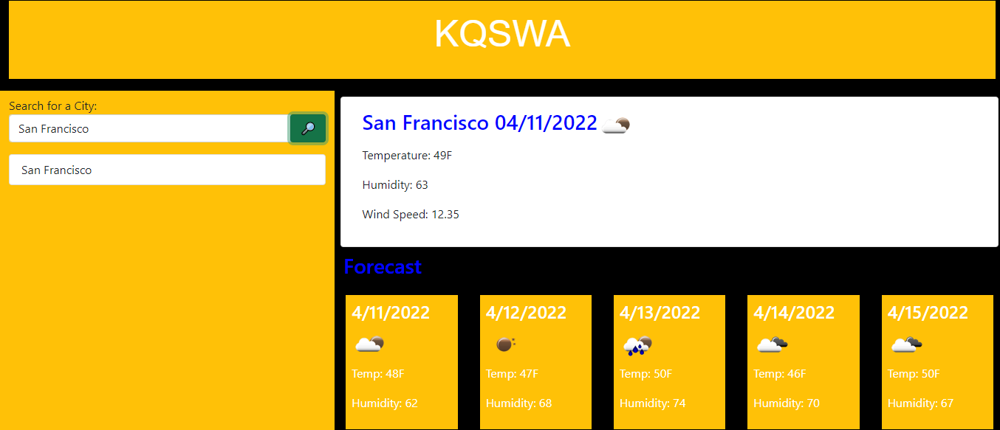

# KQSWA
## **ABOUT**
The KQSWA (pronunciation [kwus-wa]) A.K.A. the Krystopher Quintero Superior Weather Application. Is a useful tool to check current weather and forecast for any city. You can visit the deplyed link [here.](https://krystopherq.github.io/KQSWA/)

## Table of Contents
 * [Seaching](#Searching)
 * [Questions](#questions)
 * [License](#license)
            

## Searching
When searching for cities select the textbox to the left enter a city you would like to see the current weather/forecast for then select the magnify glass image to search. After each city searched a list will generate below making them accessible to select again and see the previous searched weather.

## License
MIT License

Copyright (c) 2022 Krystopher Quintero

Permission is hereby granted, free of charge, to any person obtaining a copy
of this software and associated documentation files (the "Software"), to deal
in the Software without restriction, including without limitation the rights
to use, copy, modify, merge, publish, distribute, sublicense, and/or sell
copies of the Software, and to permit persons to whom the Software is
furnished to do so, subject to the following conditions:

The above copyright notice and this permission notice shall be included in all
copies or substantial portions of the Software.

THE SOFTWARE IS PROVIDED "AS IS", WITHOUT WARRANTY OF ANY KIND, EXPRESS OR
IMPLIED, INCLUDING BUT NOT LIMITED TO THE WARRANTIES OF MERCHANTABILITY,
FITNESS FOR A PARTICULAR PURPOSE AND NONINFRINGEMENT. IN NO EVENT SHALL THE
AUTHORS OR COPYRIGHT HOLDERS BE LIABLE FOR ANY CLAIM, DAMAGES OR OTHER
LIABILITY, WHETHER IN AN ACTION OF CONTRACT, TORT OR OTHERWISE, ARISING FROM,
OUT OF OR IN CONNECTION WITH THE SOFTWARE OR THE USE OR OTHER DEALINGS IN THE
SOFTWARE.

## Questions
For questions you can contact me here on [GitHub](https://github.com/KrystopherQ).
